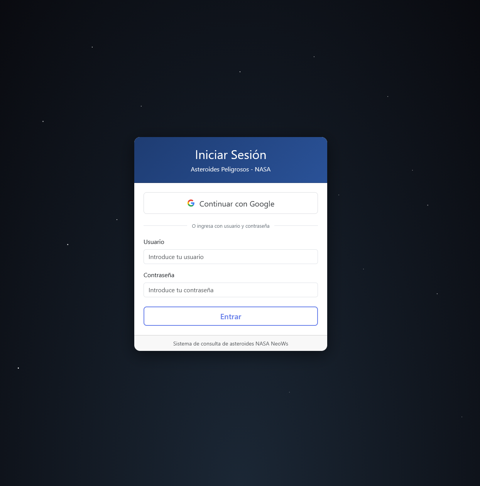
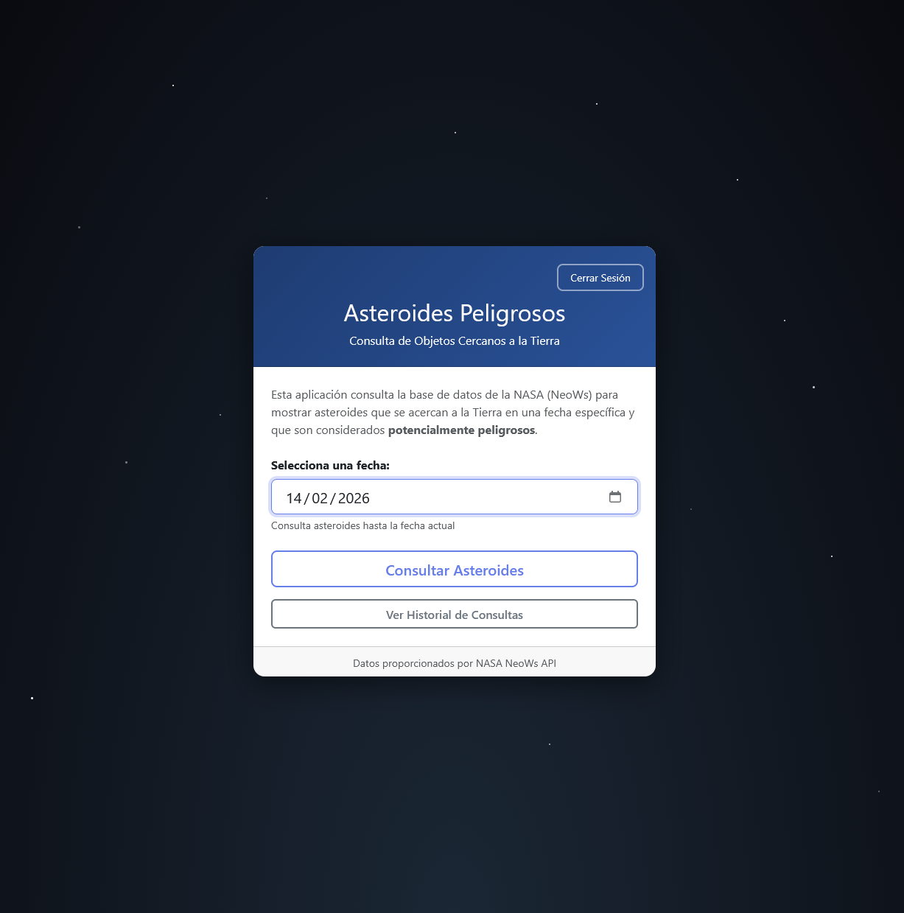
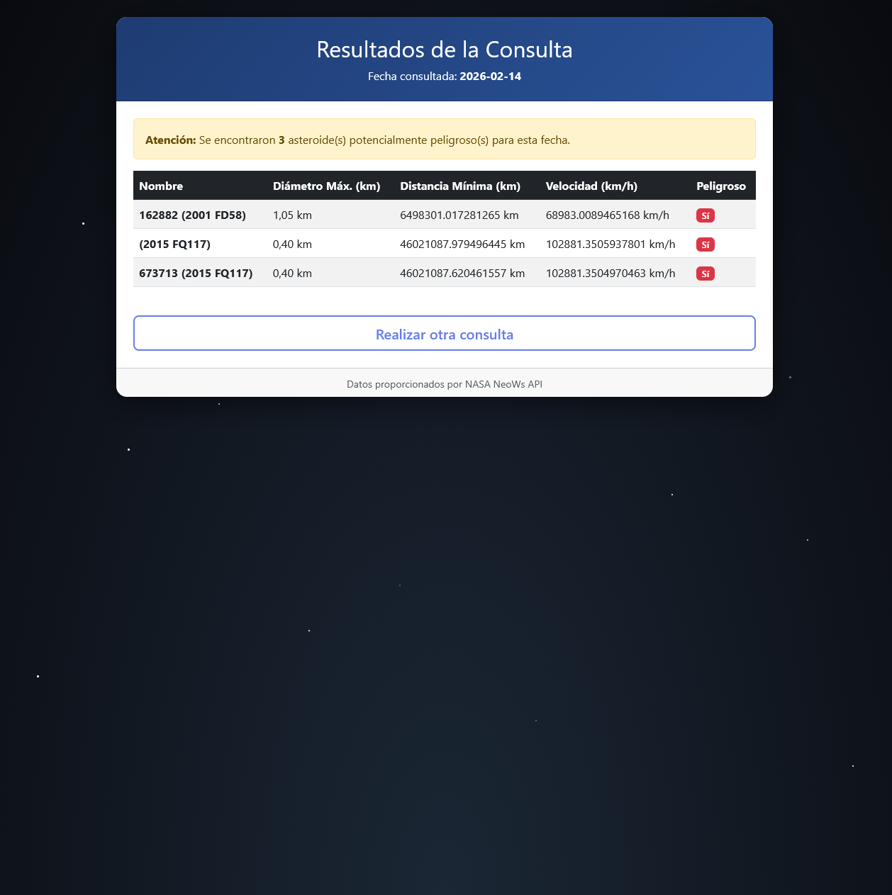
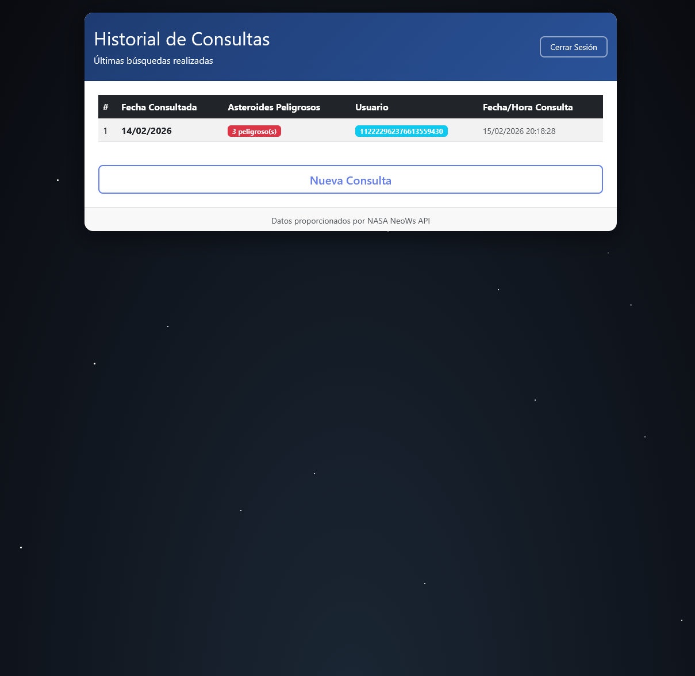

# Asteroides Peligrosos - NASA NeoWs

Aplicación web desarrollada en **Spring Boot** que permite consultar asteroides cercanos a la Tierra utilizando la API pública de la NASA (NeoWs - Near Earth Object Web Service), mostrando únicamente aquellos clasificados como **potencialmente peligrosos**.

## Características del Proyecto
- Tiene estructura Modelo Vista Controlador con Spring Boot
- Presenta consulta de asteroides por la fecha escogida
- Filtra automaticamente aquellos peligrosos
- Tiene autenticación de usuario normal y con GoogleAuth
- Historial de las ultimas consultas con base de datos interna con H2

## Herramientas
### Backend
- Java
- Spring Boot
- Spring MVC
- Spring Security
- JPA
- OAuth2
- Lombok
- RestTemplate

### Frontend
- Thymeleaf
- Bootstrap
- CSS 

### Base de datos
- H2

### API
- NASA NeoWs API

## Descripción
El proyecto es una aplicación que nos permite consultar los asteroides con potencial de ser peligrosos para la tierra por la fecha, con una pantalla de autenticacion tanto como usuario normal como con GoogleAuth, una pantalla de selección de la fecha para ver los asteroides y por ultimo, una pantalla con el historial de las consultas.

## Capturas
### Login

### Index

### Resultado

### Historial
